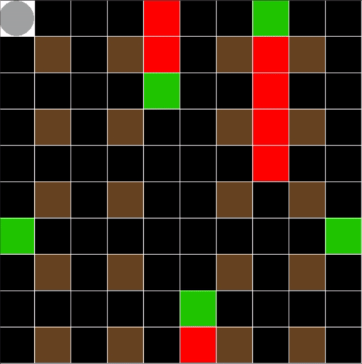

# Coverage Gridworld



## Installation

To install the environment, simply run: 

```bash
python3 -m pip install -e coverage-gridworld
```

For Stable Baselines3 training:

```bash
python3 -m pip install stable-baselines3 tensorboard
```

For rendered evaluation on Python 3.14:

```bash
brew install sdl2
python3 -m pip install pygame
```

## Stable Baselines3

The helper scripts live under `scripts/`.

List the currently available observation and reward versions:

```bash
python3 scripts/train_sb3.py --list-versions
python3 scripts/eval_sb3.py dummy_model --list-versions
```

Train on a fixed map:

```bash
python3 scripts/train_sb3.py --env-id safe --observation-version 1 --reward-version 1 --total-timesteps 100000 --num-envs 4
```

Train on random maps:

```bash
python3 scripts/train_sb3.py --env-id standard --observation-version 1 --reward-version 1 --total-timesteps 300000 --num-envs 4
```

Evaluate a saved model:

```bash
python3 scripts/eval_sb3.py trained_agents/<run_name>/final_model --env-id sneaky_enemies --observation-version 1 --reward-version 1 --episodes 3
```

Render evaluation:

```bash
python3 scripts/eval_sb3.py trained_agents/<run_name>/final_model --env-id sneaky_enemies --observation-version 1 --reward-version 1 --episodes 3 --render --delay 0.15
```

Training saves checkpoints and a final model into the chosen `--save-dir` (default: `trained_agents/`).

If you are working on your own observation/reward combination, replace the version numbers below with your pair and
use a custom run name so your outputs stay separate:

```bash
python3 scripts/train_sb3.py --env-id standard --observation-version <obs_version> --reward-version <reward_version> --total-timesteps 100000 --run-name obs<obs_version>_rew<reward_version>
python3 scripts/eval_sb3.py trained_agents/obs<obs_version>_rew<reward_version>/final_model --env-id safe --observation-version <obs_version> --reward-version <reward_version> --episodes 3
```

For a very small smoke test after changing your observation or reward code, use a shorter run such as:

```bash
python3 scripts/train_sb3.py --env-id standard --observation-version <obs_version> --reward-version <reward_version> --total-timesteps 32 --num-envs 1 --n-steps 8 --batch-size 4 --run-name smoke_obs<obs_version>_rew<reward_version>
```

For experiment sweeps and plot generation, see [experiments/README.md](experiments/README.md).

## Rules

The goal of the Agent (Grey circle) is to explore all available cells within the map as quickly as possible without 
being seen by enemies. 

Black cells have not yet been explored and White cells already have. While moving, the Agent should navigate through 
Walls (Brown) and Enemies (Green).

Also, the Enemies are on the lookout for the agent, constantly surveilling their surrounding area (Red/Light Red). 
All Enemies have a fixed range that they can observe, and they keep rotating counter-clockwise at every step. If the
Agent is seen by an Enemy, the mission fails.

## Map modes

There are three ways of defining the map layouts to be used:

### Standard maps

Five standard maps are included in the `coverage-gridworld/coverage_gridworld/__init__.py` file: 
- `just_go`: very easy difficulty map, 0 enemies and barely any walls, a simple validation test for algorithms,
- `safe`: easy difficulty map, 0 enemies and many walls,
- `maze`: medium difficulty map, 2 enemies and focuses mostly on movement,
- `chokepoint`: hard difficulty map, 4 enemies and requires precise movement and timing,
- `sneaky_enemies`: very hard difficulty map, 5 enemies and many walls, with some cells being surveilled by multiple 
enemies.

The standard maps can be employed by using their tag on `gymnasium.make()`. For example:

```python
gymnasium.make("sneaky_enemies", render_mode="human", predefined_map_list=None)
```

If a standard map is selected, then it will be used for every episode of training.

### Random maps

If the `standard` tag is used in `gymnasium.make()`, then random maps will be generated at every new episode.

Random map creation follows certain rules, such as having every `BLACK` cell reachable by the agent, but due to 
randomness, some of the maps created may be impossible to be fully explored (e.g. a cell is under constant surveillance
by 4 different enemies).

```python
gymnasium.make("standard", render_mode="human", predefined_map_list=None)
```

### Predefined map list

If you wish to have finer control of the training process of the agent, a list of predefined maps can be created and
used with `gymnasium.make()`:

```python
gymnasium.make("standard", render_mode="human", predefined_map_list=maps)
```

An example of such a list is provided in the `main.py` file.

To create a list of maps, just copy one of the provided examples and modify the values according to their color IDs:
- `3` - `GREY` -> agent (must always be positioned at cell `(0, 0)`),
- `2` - `BROWN` -> wall (walls cannot enclose an area, causing a cell to be out of reach of the agent),
- `4` - `GREEN` -> enemy (the enemy FOV cells are placed automatically by the environment and their starting orientation
is randomly determined),
- `0` - `BLACK` -> cells to be explored.

Any other color ID used will be ignored by the environment and a value of `0` will be assigned in its place.

## MDP

### Action Space

The action is discrete in the range `{0, 4}`.

- 0: Move left
- 1: Move down
- 2: Move right
- 3: Move up
- 4: Stay (do not move)

### Observation Space

Observation-space versions are implemented in `coverage-gridworld/coverage_gridworld/custom.py` and selected with
the `--observation-version` flag in the SB3 helper scripts.

### Starting State
The episode starts with the agent at the top-left tile `(0, 0)`, with that tile already explored.

### Transition
The transitions are deterministic. 

### Rewards
Reward versions are implemented in `coverage-gridworld/coverage_gridworld/custom.py` and selected with the
`--reward-version` flag in the SB3 helper scripts. Each reward function can penalize or reward certain
behaviors (e.g. hitting a wall, not moving, walking over an explored cell, etc.). The `info` dictionary returned
by the step method may be used for that. Note that not all values within the `info` dictionary need to be used.

### Episode End

By default, an episode ends if any of the following happens:
- The player dies (gets spotted by an enemy),
- Explores all tiles,
- Time runs out (500 steps are taken).


## Testing

Two functions are provided within `main.py` for quick testing of the environment: 

* `human_player()`, where the agent moves according to user inputs (WASD for directions and E for `STAY`),
* `random_player()`, for quick visualization of a randomized policy.

Both functions return the `action` variable that can be used with the `step()` function of the environment.
